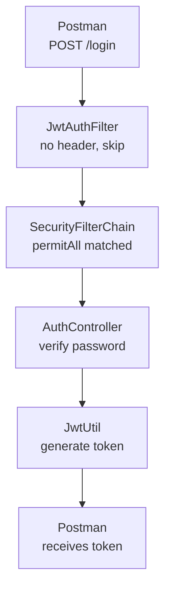
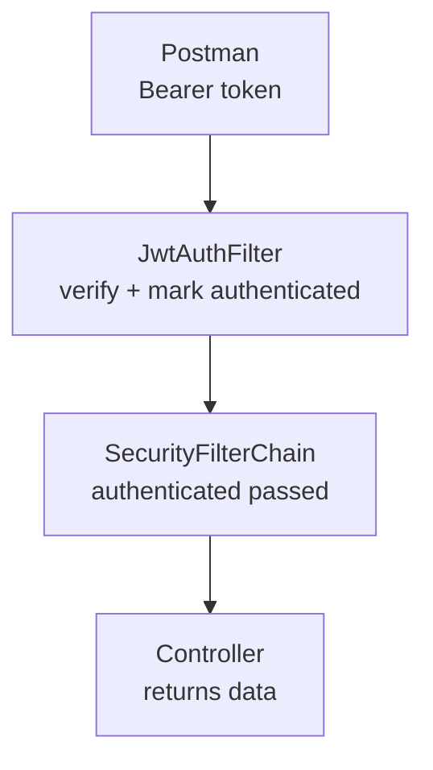

## JWT Login Flow

```mermaid
%%{init: {'flowchart': {'htmlLabels': true}}}%%
flowchart
    A[Postman<br/>POST /login] --> B[JwtAuthFilter<br/>no header, skip]
    B --> C[SecurityFilterChain<br/>permitAll matched]
    C --> D[AuthController<br/>verify password]
    D --> E[JwtUtil<br/>generate token]
    E --> F[Postman<br/>receives token]
```

## JWT Protected Request Flow

```mermaid
%%{init: {'flowchart': {'htmlLabels': true}}}%%
flowchart
    A[Postman<br/>Bearer token] --> B[JwtAuthFilter<br/>verify + mark authenticated]
    B --> C[SecurityFilterChain<br/>authenticated passed]
    C --> D[Controller<br/>returns data]
```
